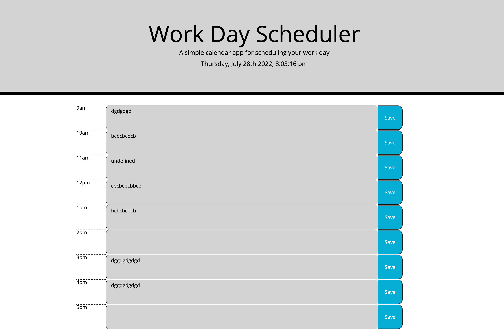

# work_day_scheduler

## Description

I was tasked with finishing a very incomplete daily planner app using Jqeury and bootstrap. There was no functionality whatsoever, and little structure, but there was a decent amount of classes and styles predefined. 

The complete application has a dynamic time/date displayed on the header that updates every second, using moment.js and a simple 1000 milisecond interval. The headers background changed depending on wether the current time is before the time period represented by the time blocks, during, or after. The individual timeblocks are also color coded in a similar way. Besides this the app has limited visual styling, meant for personal use and since the app is open source, personal customization.

There is a 'Save' button to the right (On the bottom on smaller screens) of the timeblock which sends the user input to local storage using a special two digit class snippit in the parent div as the key, and userinput as the value. The saved value is retrieve and placed in the textbox upon refresh using another unique identifier. When a timeblock is marked as "past", the user cannot add input text to that block. 

## Installation

1. Thanks to the World Wide Web you can view this document from any net-connected device using the following HyperText Transfer Protocol Secure Address: https://deviousdoge.github.io/work_day_scheduler/

2. Source code can be viewed by cloning the repository found here to your local machine using git bash (PC) or HomeBrew (Mac): https://github.com/DeviousDoge/work_day_scheduler

3. Document is structured with index.html and styled with reset.css and style.css. Document is scripted with script.js.

## Usage

The App outside of business hours

